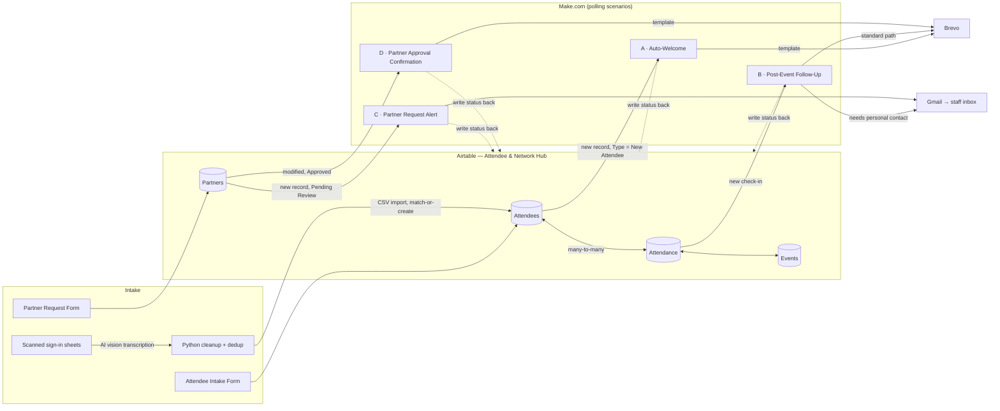
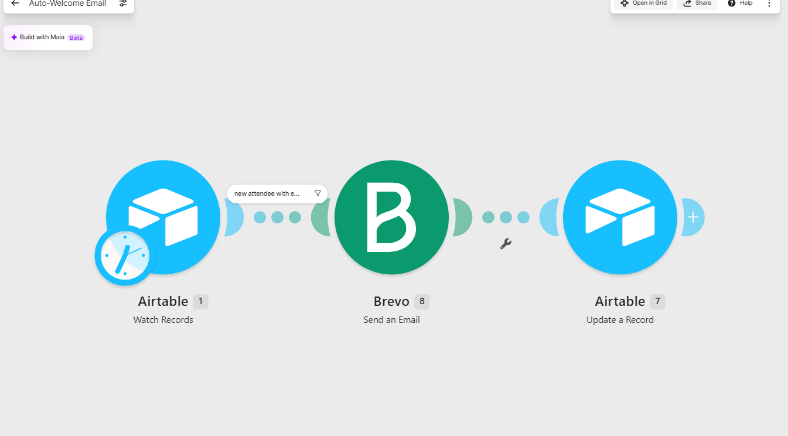
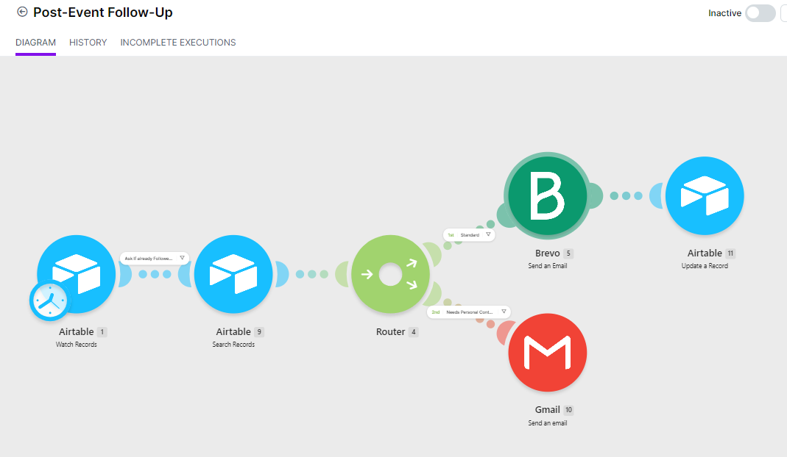
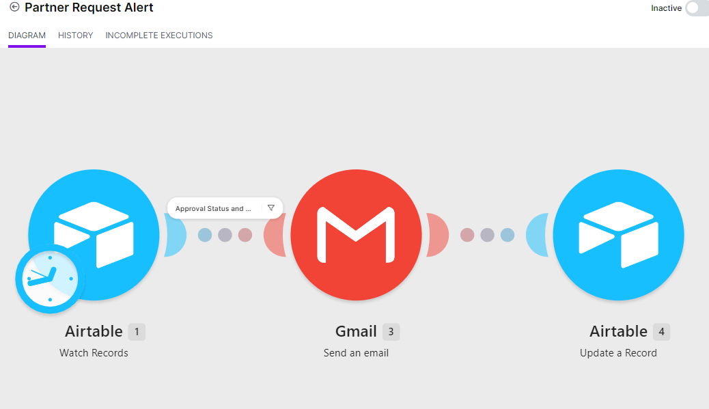
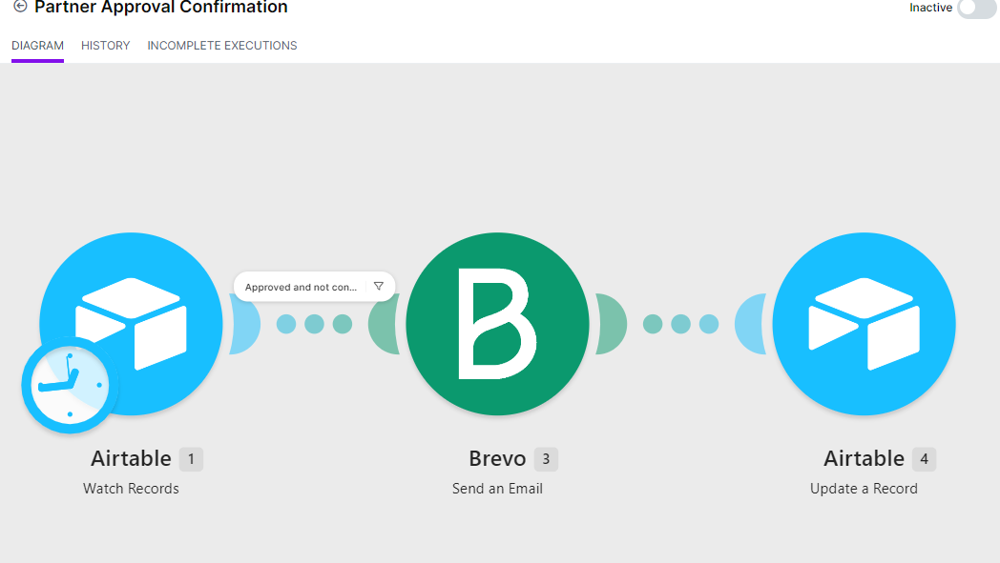

# Attendee & Partner Automation System

**Airtable + Make.com + Brevo: an attendee CRM and partner-approval pipeline for a multi-program nonprofit.**

This system turned three years of paper sign-in sheets into a relational CRM. It also automates welcome emails, post-event follow-ups and partner onboarding, so staff never have to send them by hand.

> **Client confidentiality:** This is a portfolio version of a real client build. The organization's name, staff contacts, attendee records, account IDs and credentials have been removed. All data in `data/samples/` is synthetic.

   

---

## The problem

The client ran recurring trainings, luncheons and an annual summit across several counties. Attendance lived on **34 pages of handwritten sign-in sheets** collected from 2023 to 2026. Nobody was following up with attendees consistently, and partner organizations asking to join the network were tracked in an inbox.

The client also had an existing Airtable base shared across several programs. So new contacts couldn't just be appended. Each one had to be checked against existing people first.

## What was built

| # | Deliverable | Outcome |
|---|---|---|
| 1 | **Spreadsheet migration**: six event registration and sign-in files combined, deduplicated and split into linked tables | 279 raw rows → **237 unique attendees**, 6 events and 249 attendance records. 19 data-quality issues were set aside in a review file |
| 2 | **Sign-in sheet digitization**: AI-assisted transcription of 34 scanned pages, then cleanup and dedup | 375 sign-in lines → **143 unique contacts**, with 53 flagged for human review (illegible surname, no email, first name only) |
| 3 | **Relational data model**: Attendees ⇄ Attendance ⇄ Events (many-to-many via a junction table), plus Partners and Meetings | Per-person attendance history and automatic per-event headcounts |
| 4 | **Scenario A: Auto-Welcome Email** | New attendees get a branded welcome email within 15 minutes |
| 5 | **Scenario B: Post-Event Follow-Up** | Each check-in triggers a follow-up email. Attendees flagged *Needs Personal Contact* are sent to staff instead |
| 6 | **Scenario C: Partner Request Alert** | Staff get an email when a partner organization applies |
| 7 | **Scenario D: Partner Approval Confirmation** | Approving a partner in Airtable automatically emails them a confirmation |
| 8 | **Handoff kit**: operations guide, troubleshooting cheat sheet, credential handoff and a recorded walkthrough | Non-technical staff can run the system on their own |

## Architecture



Every scenario writes a status back to Airtable after it sends (for example `Outreach Status`, `Alert Sent` or `Confirmation Sent`). The next poll skips any record that already has that status, so **no one gets the same email twice.** See [docs/architecture.md](docs/architecture.md).

## Repository layout

```
.
├── docs/
│   ├── architecture.md        # Design decisions, idempotency, polling tradeoffs
│   ├── data-model.md          # Airtable schema: tables, fields, links, status values
│   ├── data-migration.md      # Spreadsheets + scans → dedup → Airtable import
│   ├── build-log.md           # Bugs found & fixed during the build (case study)
│   ├── operations-guide.md    # Staff-facing guide (approve partners, flag attendees…)
│   ├── troubleshooting.md     # Cheat sheet for common failure modes
│   ├── scenarios/             # One spec per Make.com scenario (A–D)
│   └── images/                # Scenario canvas screenshots
├── scripts/
│   └── dedupe_contacts.py     # Merge transcribed sign-ins into unique contacts
├── tests/
│   └── test_dedupe_contacts.py
├── data/samples/              # Synthetic example inputs/outputs only
├── make/blueprints/           # Where exported Make scenario blueprints go (sanitized)
├── brevo/templates/           # Email template param contracts
└── .env.example
```

## Running the cleanup script

```bash
python -m venv .venv && source .venv/bin/activate
pip install -r requirements.txt

# Merge raw transcribed sign-in lines into unique contacts
python scripts/dedupe_contacts.py data/samples/signins_raw.csv -o out/contacts_clean.csv

# Also check against an export of the existing Airtable Attendees table
python scripts/dedupe_contacts.py data/samples/signins_raw.csv \
    --existing data/samples/airtable_attendees_export.csv \
    -o out/contacts_clean.csv

pytest
```

The script uses only the standard library. `pytest` is the only dev dependency.

## Key engineering decisions

- **Make.com over native Airtable Automations.** Branching (the router in Scenario B), cross-table lookups and third-party email (Brevo) all needed more than Airtable's built-in automations offer.
- **Status fields as idempotency keys.** Polling triggers can pick up the same record more than once. Writing a status back after each send makes every scenario safe to re-run.
- **`Import Flag` guard.** Bulk-imported history (hundreds of past sign-ins) would otherwise set off a flood of welcome and follow-up emails. Records marked as imports are skipped.
- **Match before create.** The Attendees table is shared across programs, so new contacts are matched by email first, then by name + organization. They are only created when nothing matches.
- **Last Modified trigger for approvals.** Scenario D watches a *Last Modified Time* field, not *Created Time*, so it catches a status change on a record that already exists.

## Screenshots

| Auto-Welcome | Post-Event Follow-Up |
|---|---|
|  |  |
| **Partner Request Alert** | **Partner Approval Confirmation** |
|  |  |

## Author

**Maria Fe Blanca**, AI Systems & Automation Specialist · [JM Brandify](https://github.com/mariafe-jmbrandify)
