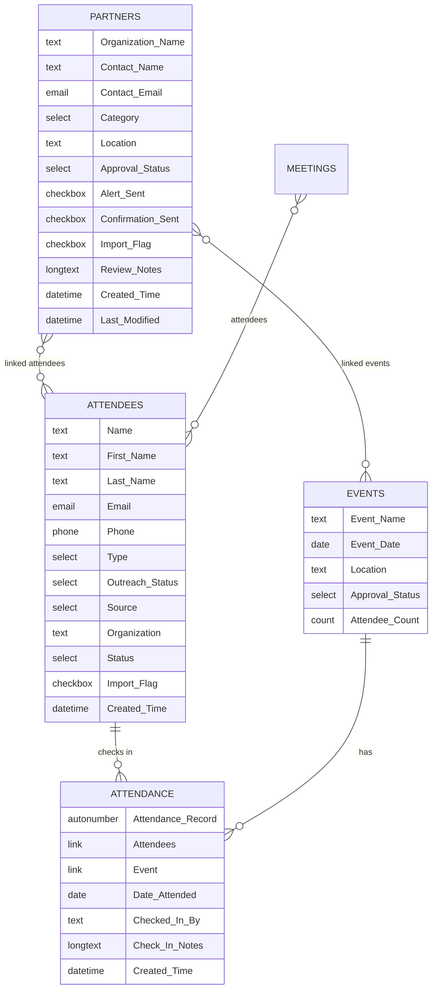

# Data Model — Airtable "Attendee & Network Hub"

The base has five tables. Attendees, Attendance and Events form the core. **Attendance is a junction table**: each row is one person checking in to one event. That makes the Attendee ⇄ Event relationship many-to-many.

## Why a junction table

The first versions linked Attendees straight to Events. Every return visit then overwrote the previous one, and there was nowhere to store *when* someone checked in or any notes about it. Moving to a dedicated Attendance table fixed both problems:

- **Attendee record → linked Attendance:** the person's full history
- **Event record → linked Attendance:** the full roster. `Attendee Count` is a count field, so it's never tallied by hand.
- **Scenario B triggers on new Attendance rows.** A follow-up goes out once per check-in, not once per person.

Getting this relationship mapped correctly, both in Airtable and in Make's lookup modules, took several rounds of testing. It was the hardest part of the build.

## Status fields (automation contracts)

These fields tell the automations what to do. Changing one by hand changes what the automations do next.

| Field | Table | Values | Read by | Written by |
|---|---|---|---|---|
| `Type` | Attendees | New Attendee, Returning Attendee, Volunteer, Staff, Speaker, Student, Professional | A (must equal `New Attendee`) | Intake form / staff |
| `Outreach Status` | Attendees | *(blank)*, Welcome Sent, Follow-up Needed, Follow-up Sent, Needs Personal Contact, Completed, Contacted, Registered | A, B | A → `Welcome Sent`; B → `Follow-up Sent` |
| `Import Flag` | Attendees, Partners | checkbox | B, C | Set to true on bulk imports so historical records don't trigger emails |
| `Source` | Attendees | Online Signup, Event/Meeting Sign-in, Social Media, Referral… | none | Set once at creation |
| `Status` | Attendees | Active, … | none | New imported rows default to `Active` |
| `Approval Status` | Partners | Pending Review, Approved | C (Pending/blank), D (Approved) | Staff |
| `Alert Sent` | Partners | checkbox | C | C → true |
| `Confirmation Sent` | Partners | checkbox | D | D → true |

Only two `Outreach Status` values change what Scenario B does. `Needs Personal Contact` sends the attendee to the staff alert path. Any other value, or blank, gets the standard follow-up email.

## Planned (Phase 2)

- **Events submission workflow:** a public form feeding Events, with `Approval Status` values Pending Review → Needs More Info → Approved → Published / Declined / Canceled
- **Calendar publishing:** approved events pushed to the organization's shared Google Calendar and shown on a public calendar page
- **Partner directory:** a public listing of approved partners
- **Automated intake:** new scans and Excel sign-in files run through the same transcribe → dedup → import pipeline
