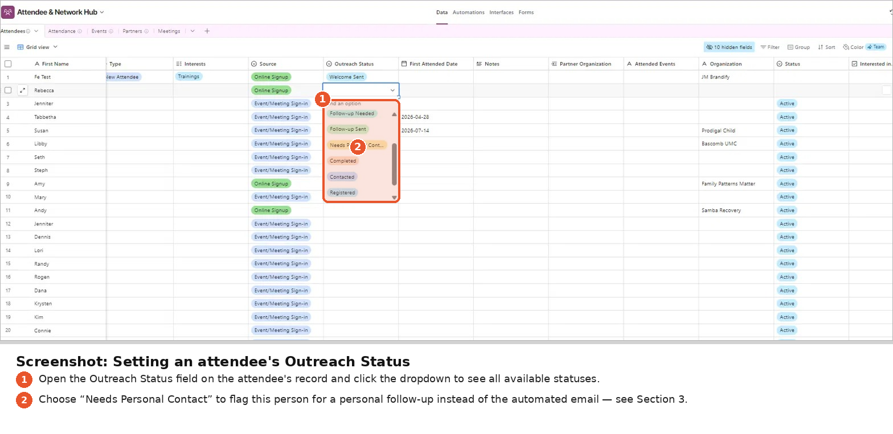
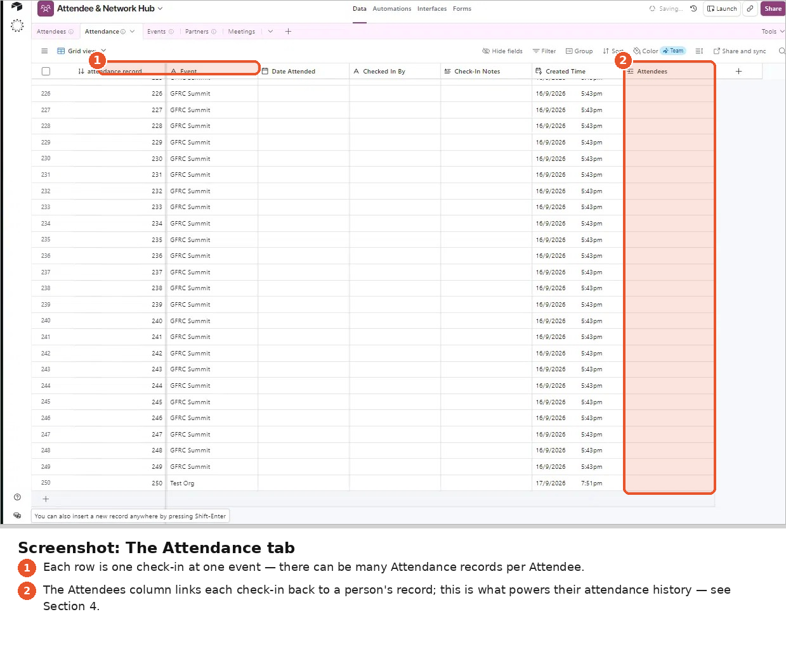
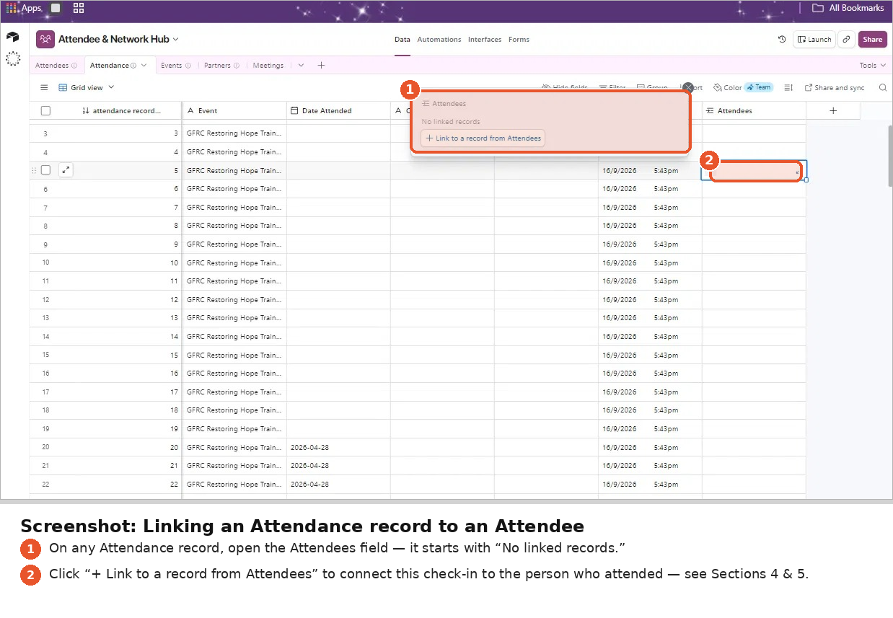
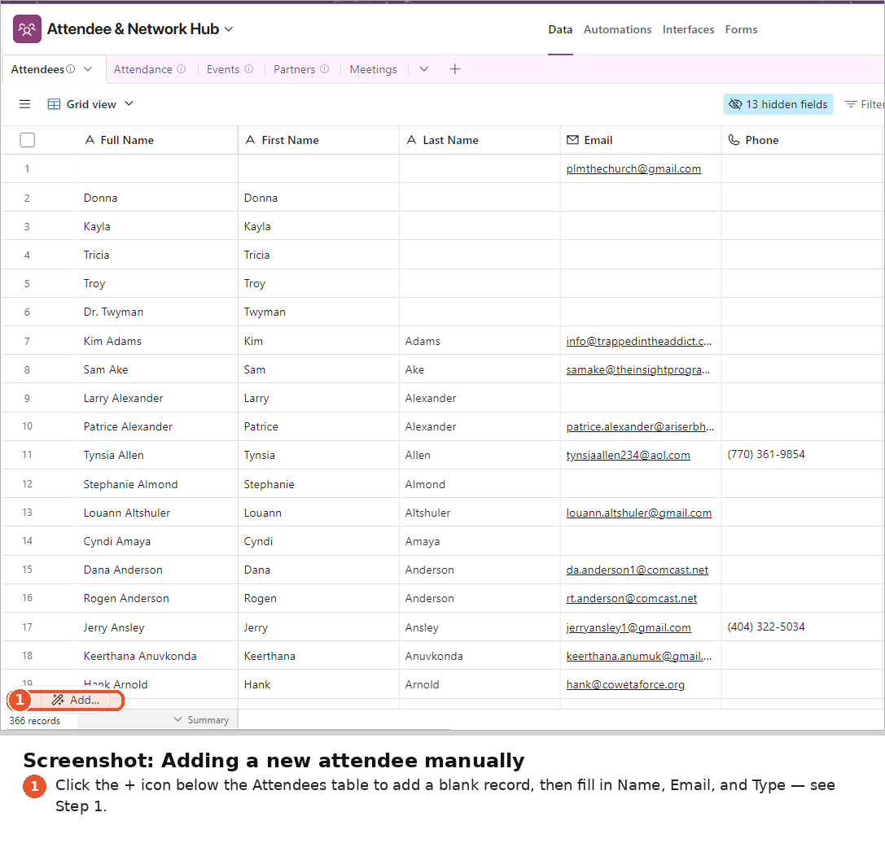
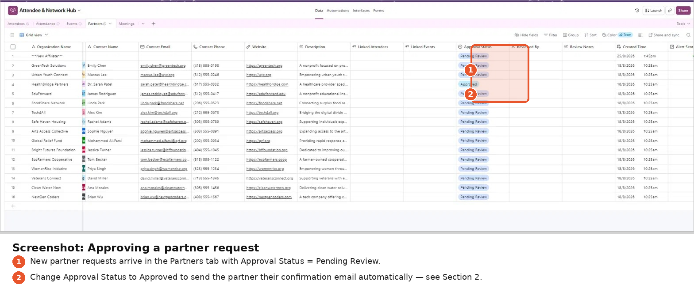
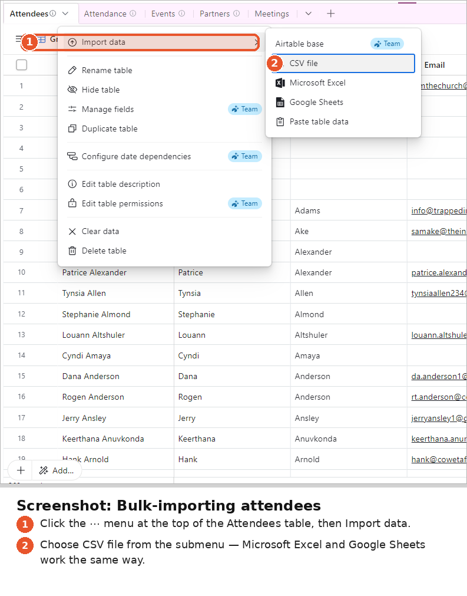

# Operations Guide (Staff-Facing)

A plain-language guide for the non-technical staff who run the system. Staff work in Airtable, and the automations run in the background.

## 1. Approve or reject a partner request

1. Open the **Partners** tab. New requests arrive with `Approval Status` = *Pending Review* (or blank), and the staff inbox gets an alert.
2. To approve, set `Approval Status` → **Approved**. A confirmation email goes out within about 15 minutes.
3. To reject, leave the status as it is or add a note in `Review Notes`. *No automatic rejection email is sent. Reply by hand if needed.*

> Move a record to Approved **once**. `Confirmation Sent` stops duplicate emails, but switching the status back and forth makes the history harder to read.

## 2. Flag an attendee for personal follow-up

Set their `Outreach Status` → **Needs Personal Contact**. Their next check-in sends staff an alert with their name, email, phone and event, and no automated email goes to the attendee.

## 3. View attendee history

- **Attendee record → linked Attendance:** every event they attended, with dates and check-in notes.
- **Event record → `Attendee Count`:** filled in automatically.
- If an Attendance row's `Attendees` link is empty, that check-in won't appear on anyone's history.

## 4. Add a walk-in

1. Attendees → **+ Add record**. Fill in at least Name, Email and **Type**.
2. Set `Type` = **New Attendee** if they should get the welcome email.
3. Log the visit in **Attendance** by linking the person and the event.

## 5. Bulk import from CSV / Excel

Attendees → **⋯ → Import data → CSV file**. Check the column mapping. Imported records only get welcome emails if `Type` = New Attendee. Set `Import Flag` = true on historical rows so they don't trigger follow-ups.

## 6. Status reference

See [data-model.md → Status fields](data-model.md#status-fields-automation-contracts).
